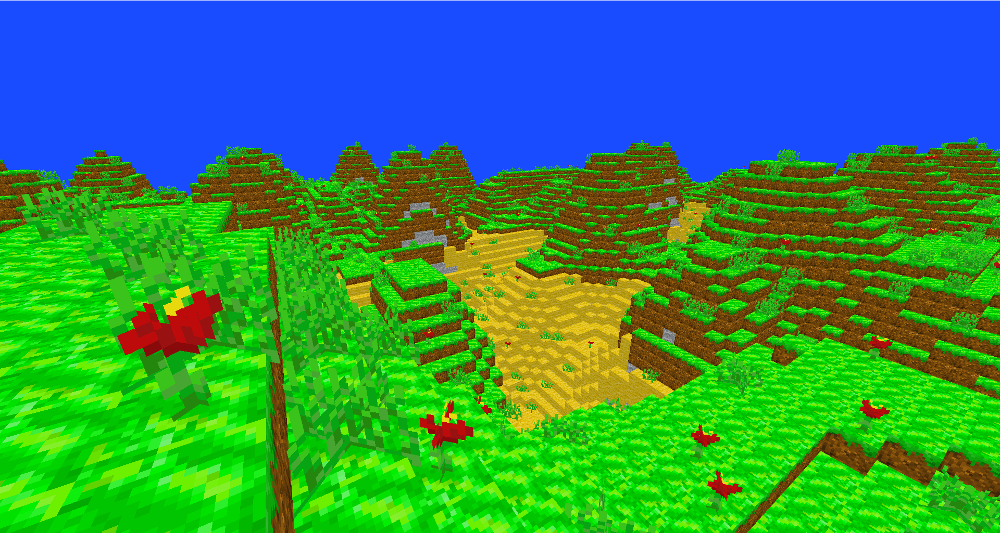
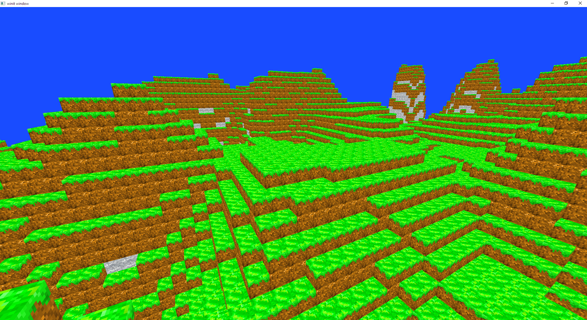

# Matrixagon
A game heavily-inspired by the terrain generation of Minecraft and other Minecraft
mods using Rust's Vulkan Wrapper (Vulkano) to construct the game.

### General
This game is a block-based game similiar to Minecraft, but prioritize on block 
simulation but with added minimal gameplay.

It specializes in realistic and fantastical terrain generation, weather systems,
machine learning entities, and other components. And hopefully a total modularized
systems with everything customizable from player commands to internal render meshes.

### Development Status
This game is still heavily in development. Check [CHANGELOG](CHANGELOG.md) for future plans

The game will try to update weekly as possible.

### Installing and Running
This project will not be compiled to binaries as of yet. Though compiling the source
code is always avaiable as the codebase is open-sourced right here!

NOTE: The following procedure assumes you are on a OS (that also supports Vulkan API).

NOTE: The current CPU (Intel i7 8th gen) usage can be up to 80-100% when generating a lot of chunks
NOTE: The current Memory usage can be 2K-5K MB; fluctuates a lot when generating chunks

1. Under the green button of this repo's homepage, click on "Download ZIP"
2. Find the zip file, then extract to your desired location.
    2. Go extract it to "C:/Users/<USERNAME>/Desktop" (on Windows) if you do not know where to extract
3. Open command prompt
4. Type in and enter `cargo init`
5. Type in and enter `cargo run`
    5. This will compile and manage the dependencies all for you
6. A small window should pop-up

### Tutorial / Wiki
#### Keymapping
[W] - Forward  
[A] - Left  
[S] - Back  
[D] - Right  
[LSHIFT] - Downward  
[SPACE] - Upward  

[T] - Escape mouse lock and world.player rotation  
[CTRL] + [W]/[A]/[S]/[D]/[LSHIFT]/[SPACE] - To increase the player movement

*Yet to be implemented*
[L-CLICK] - Break block
[R-CLICK] - Place Block
